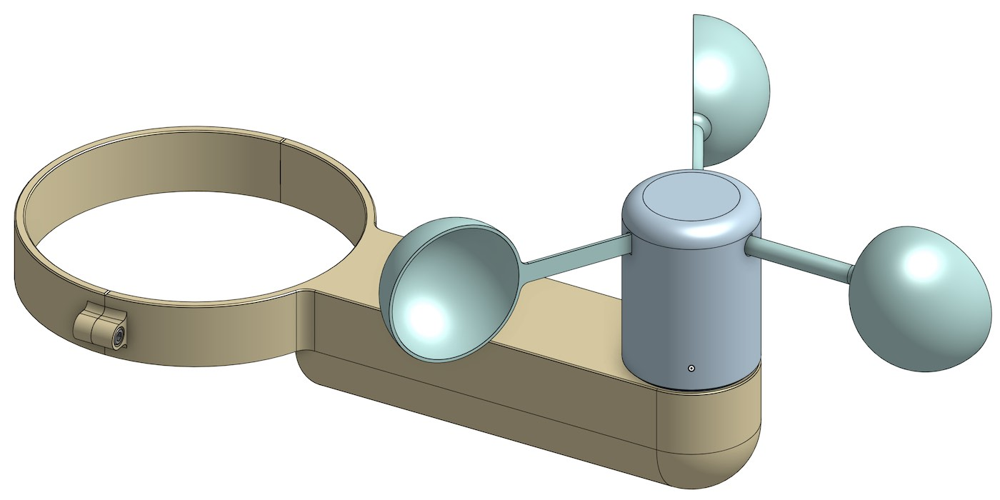
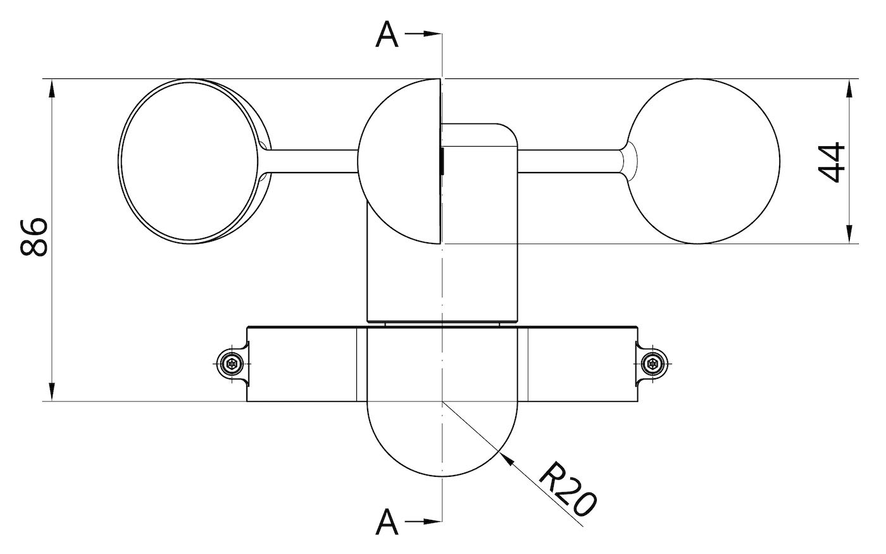
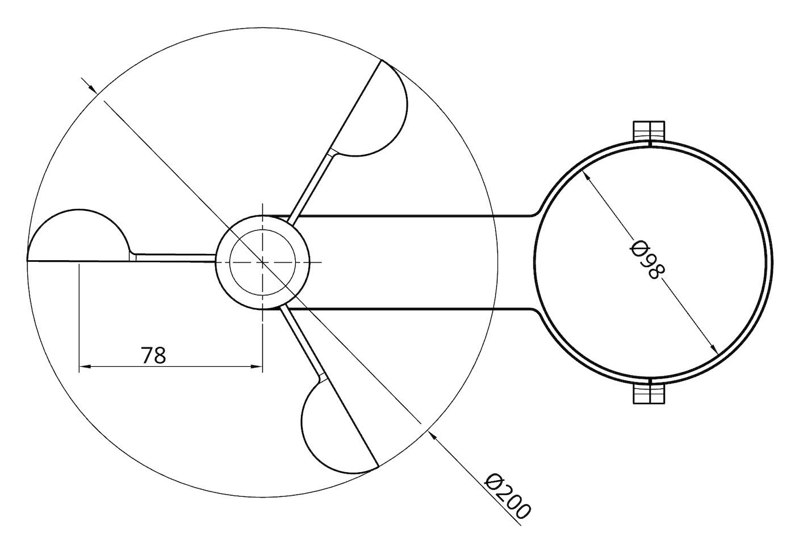
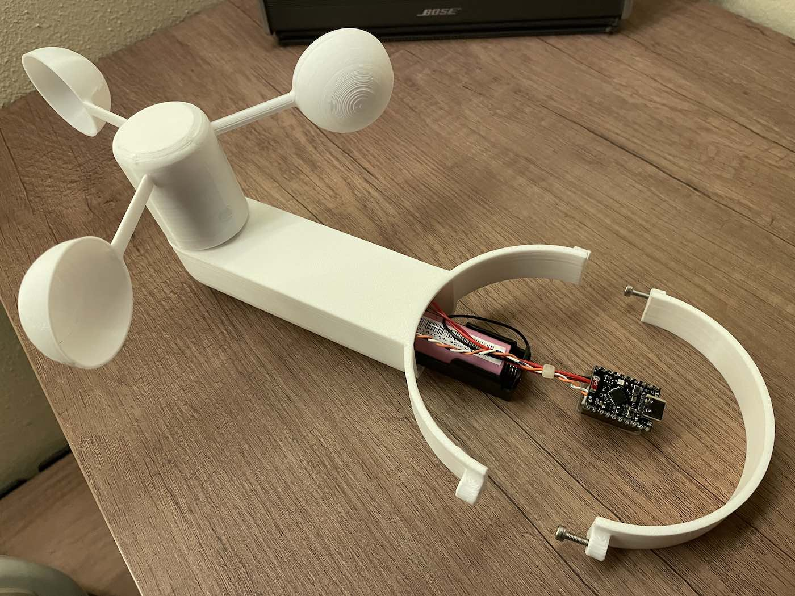

# 🌀 ESP32-C6 ULP BLE Anemometer (BTHome V2)

A high-efficiency, battery-powered wind speed sensor (Anemometer) using the ESP32-C6. This project leverages the **ULP (Ultra-Low Power) co-processor** to monitor wind pulses while the main CPU is in Deep Sleep, allowing for years of battery life.

The project uses the LP/ULP core to count anemometer pulses while the main CPU stays in deep sleep, then wakes periodically to compute wind speed and advertise telemetry over BLE using BTHome v2 format.

## 🚀 Key Features

* **Ultra-Low Power:** Can be as low as **\~15µA** in deep sleep on the ESP32-C6 alone. Actual current depends on the board and any attached hardware. The main cores only wake up to calculate and transmit data.
* **BTHome V2 Protocol:** Works natively with **Home Assistant** via Bluetooth—no custom integration or ESPHome YAML required. See [bthome.io](https://bthome.io).
* **Waterproof:** Designed to be waterproof for outdoor use.
* **Intelligent Reporting:**
  * **Wind Detected:** Typically reports on the next 5-second wake cycle while wind is present.
  * **Change Detection:** Tries to report a speed change as soon as it is noticed on the next wake cycle.
  * **Heartbeat:** Sends a periodic "still alive" update, usually about every 60 seconds during calm periods.
* **Hardware Debouncing:** ULP-based software sampling filters out mechanical reed switch "bounce."

## 🎓 What You Can Learn and Reuse in Your Projects

If you are building a similar low-power sensor, these patterns are practical to reuse:

* Keep the main CPU in deep sleep and let the LP/ULP RISC-V core handle pulse counting.
* Wake on a fixed interval, compute pulse delta and wind speed, then advertise only when needed.
* Use BTHome v2 so the sensor works directly with Home Assistant over BLE.
* Add a heartbeat report so the device still publishes when conditions are calm.
* Filter reed-switch bounce in ULP software instead of relying only on hardware.
* Use RTC-capable GPIOs for ULP inputs on ESP32-C6, and avoid strapping pins.
* Add a capacitor across the battery sense divider to stabilize high-impedance ADC readings.
* Keep timing, calibration, BLE, and ADC values in a single header so they are easy to tune.
* Treat wind-speed calibration as a single empirical factor that can be adjusted without changing the rest of the flow.
* Preserve the PlatformIO + ESP-IDF setup and the debug/release sdkconfig defaults for repeatable builds.

## 🛠 Hardware Requirements

1. **ESP32-C6  Board** (e.g., ESP32-C6 Super Mini).
   * For ESP32 and ESP32-S3 boards, check the [ESP32/ESP32-S3](https://github.com/alf45tar/ESP32-ULP-BLE-Anemometer) anemometer project.
2. **Anemometer** (3-cup type with a Reed Switch).
3. **Battery:** Li-ion 18650 or LiPo.

### 📦 Bill of Materials

| Item | Quantity | Notes |
| :--- | :--- | :--- |
| ESP32-C6 Super Mini | 1 | Very cheap and low power board |
| 3D-printed anemometer | 1 | STL files for the [3D-printed parts](https://github.com/alf45tar/Anemometer/tree/main/stl) |
| 608 bearing 8x22x7 mm | 1 | Very common bearing for shaft support |
| M3 heat-set insert | 3 | For connecting the main body to the support and collar |
| M3 hex socket cap screw M3x10 | 3 | Fastens the main body to the support |
| Reed switch | 1 | Wind pulse sensor |
| Magnet 6x3 mm | 2 | For triggering the reed switch |
| O-Ring 8x2 mm | 1 | To seal the base of the rotor and the support |
| Battery | 1 | Li-ion 18650 or LiPo |
| Battery Holder | 1 | |

### 🔌 Wiring

Connect the reed switch between SENSOR_GPIO pin and GND (no need of external pull-up resistor because internal pull-up resistor is used).

```text
  SENSOR_PIN
      |
      |
      +  |
         +--- Reed switch
      +  |
      |
      |
     GND
```

For battery monitoring, a 470 kΩ resistor divider is required.
For stable ADC readings with high-value resistors, place a 0.1uF capacitor from ADC pin to GND.

```text
              BATTERY_ADC_GPIO
                     |
                     |
B+ -----/\/\/\/------+-----/\/\/\/-----+----- GND (B-)
         470k        |      470k       |
                     |                 |
                     +-------||--------+
                            0.1uF
                         (optional)
```

## 💻 Software Requirements

* PlatformIO
* ESP-IDF framework via PlatformIO (already defined in `platformio.ini`)

## 📡 Telemetry Format (BLE)

Advertising payload includes BTHome v2 service data with:

* Packet ID (object id `0x00`)
* Battery percentage (object id `0x01`)
* ESP32-C6 internal temperature in 0.01 °C units (object id `0x02`)
* Wind speed in 0.01 m/s units (object id `0x44`)

Device name in advertisement: `Wind Sensor`

Note: the temperature value is the ESP32-C6 internal chip temperature, not an ambient room sensor. Because the CPU spends most of its time in deep sleep, this reading is typically close to ambient. The internal temperature sensor is configured for a `-10` to `80` °C range.

## ⚙️ Key Tuning Constants

Edit `src/anemometer.h`:

```c
#define SENSOR_PIN 6                        // GPIO used for the anemometer pulse input
                                            // Must be RTC-capable pin: GPIO0-GPIO7 on ESP32-C6
                                            // Avoid GPIO4 and GPIO5 which are used for strapping
#define SLEEP_DURATION 5                    // Deep-sleep interval in seconds between wakeups
#define HEARTBEAT_INTERVAL 60               // Force a periodic telemetry heartbeat every N seconds
#define DEBOUNCE_INTERVAL_CYCLES 1000       // Minimum ULP clock cycles between valid edges to filter out noise (debouncing)

/* Anemometer conversion constants */
#define PULSES_PER_ROTATION 2.0f            // Sensor pulses generated for one full rotor rotation
#define RADIUS 0.078f                       // Rotor radius in meters (center to cup midpoint)
#define CALIBRATION_FACTOR 2.5f             // Empirical multiplier to match real wind speed

/* BLE/BTHome beacon behavior */
#define BLE_ADV_DURATION_MS 1000            // Advertising window duration after each wakeup
#define BLE_ADV_INTERVAL_UNITS 32           // BLE adv interval units (0.625 ms each): 32 = 20 ms

/* Battery measurement via ADC */
#define BATTERY_ADC_GPIO 0                  // GPIO connected to battery sense divider output
                                            // Must be an ADC-capable pin: GPIO0-GPIO6 on ESP32-C6
                                            // Avoid GPIO4 and GPIO5 which are used for strapping
#define BATTERY_ADC_SAMPLES 1               // Number of ADC readings averaged per measurement
#define BATTERY_VOLTAGE_DIVIDER_RATIO 2.0f  // Scale factor from ADC node voltage to battery voltage
#define BATTERY_MIN_MV 3200                 // Battery voltage mapped to 0%
#define BATTERY_MAX_MV 4100                 // Battery voltage mapped to 100%
```

## 🔄 How It Works

1. The main CPU enters deep sleep.
2. LP/ULP firmware monitors the sensor pin (`SENSOR_PIN`) and increments pulse count on valid rising edges.
3. Every wake interval (`SLEEP_DURATION`), the main CPU wakes up.
4. Firmware computes:
   * pulse delta
   * RPM
   * wind speed (m/s and km/h)
   * battery voltage and percentage
   * ESP32-C6 internal temperature
5. BLE advertising is sent when:
   * wind value changed, or
   * heartbeat interval is reached
6. Device returns to deep sleep.

## 📐 Dimensions




## 🧪 Photos




## 📜 License

This project is licensed under the MIT License - see the LICENSE file for details.
